**ArcGIS Experience Builder Tutorial**

Create web apps you envision

ABT 182 - Advanced GIS

Instructor: Ali Moghimi

University of California, Davis

Source: Esri Developers

---

## Table of Contents

- [How to Use Experience Builder](#how-to-use-experience-builder)
- [Experience Builder Components](#experience-builder-components)
  - [Widgets](#widgets)
  - [Pages](#pages)
  - [Data](#data)
  - [Content, Style, and Action](#content-style-and-action)
  - [Interactivity](#interactivity)
  - [Publishing and Sharing](#publishing-and-sharing)
- [Example Exercise: Create an App for Yosemite National Park](#example-exercise-create-an-app-for-yosemite-national-park-to-show-the-trails)
  - [1) Quick setup](#1-quick-setup)
  - [2) Adding Header](#2-adding-header)
  - [3) Adding Data](#3-adding-data)
  - [4) Adding Page](#4-adding-page)
  - [5) Connecting Widgets](#5-connecting-widgets)
  - [6) Adding Actions to the Widgets](#6-adding-actions-to-the-widgets)
  - [7) Dynamic Content & Data View](#7-dynamic-content--data-view)
  - [8) Adding chart](#8-adding-chart)
  - [9) Mobile Optimization](#9-mobile-optimization)
  - [10) Publishing Apps](#10-publishing-apps)

---

---

## How to Use Experience Builder

1- Navigate to ArcGIS Online webpage at [ArcGIS Online](https://www.arcgis.com/index.html)

2- Sign in with the organization\'s URL and enter *ucdavis.maps.arcgis.com*. Then, click on "Continue".

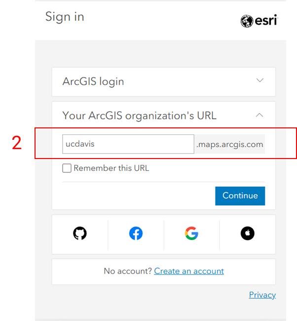

3- Click on "Kerberos Login", and enter your Kerberos name and password in the new page.

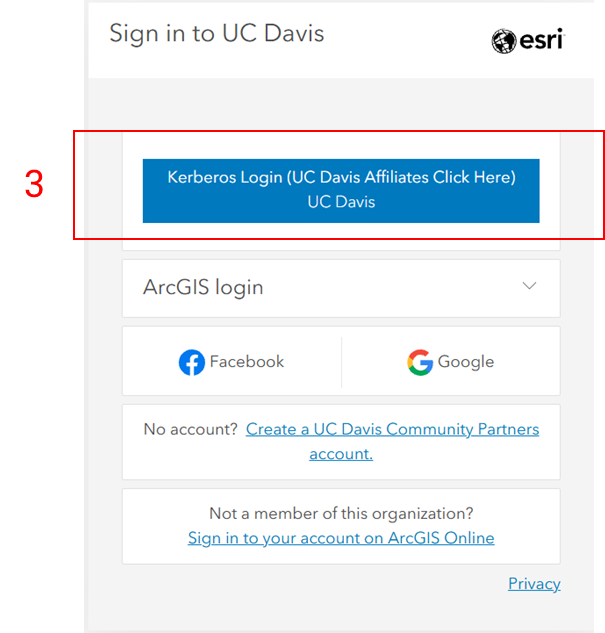

4- Open the app launcher next to your profile photo on the top left, and select "Experience Builder" from the list.

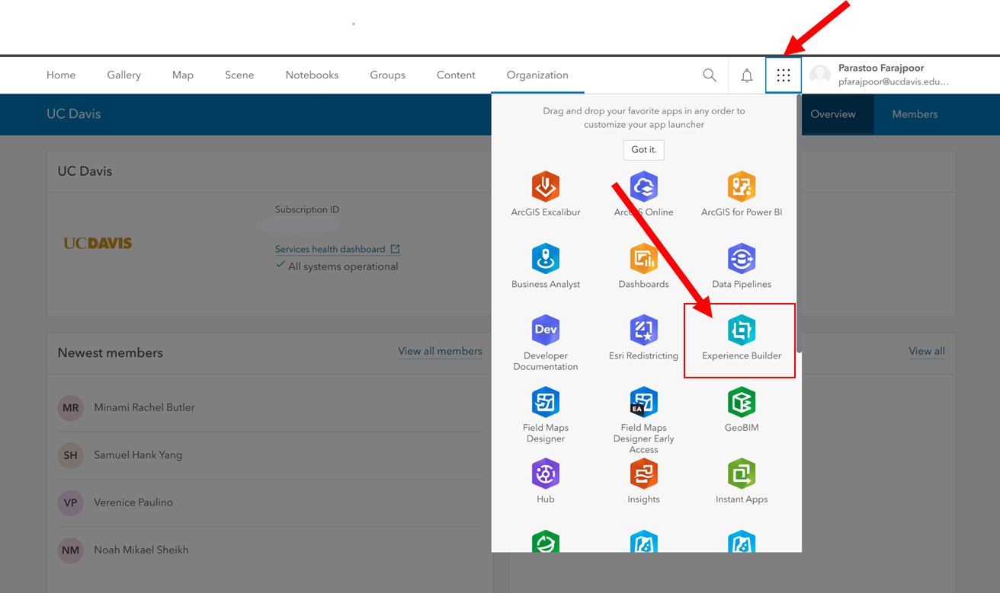

5- This is where you can manage or create your apps. You can create a new app by clicking on "+ Create New".

6- You can start with a blank page, or you can start from the templates.

Templates are good starters and you can easily modify them. For this exercise, find "**Launchpad**" from the templates, and click on "Create".

7- This is your "Canvas of Creativity" now! You can build and interact with your application here.

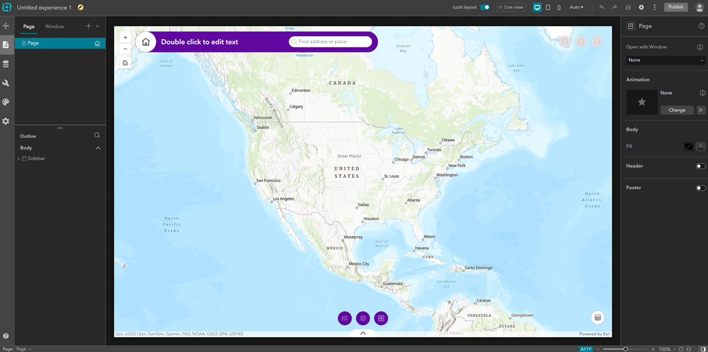

---

## Experience Builder Components

**Widgets**\
Widgets are like legos that you use to build your app. Whatever you add to the app including map, table, chart, text, filter, search, legend, and menu is a widget. Each widget is a tool or visual component that performs one function. We have 3 types of widget:\
1- Map-centric: Map-centric widgets require a map to work. For example if you add a legend to the map, this legend is a map-centric widget because it needs a map to work with.\
2- Data-centric: Data-centric widgets work directly with data. For example table, chart, etc.\
3- Layout: Layout widgets organize other widgets but do not perform analysis. Common layout widgets include row, column, grid, section, and fixed panel. For example, you might use a row to split the screen into left and right areas, and columns to stack widgets vertically.

**Pages**\
A page is like a screen in your app. You can have one page or multiple pages. Each page can contain its own layout and widgets. Each page can have a header, which can be shared across pages.

**Data**\
Data is the foundation of your app. Data usually comes from feature layers, web maps, or web scenes. Feature layers contain the actual geographic features and their attributes (such as year, etc.). A web map or web scene defines how that data looks (symbology, popups, basemap). Widgets connect to data in order to display or analyze it.

**Content, Style, and Action**\
Most widgets have three main configuration areas:\
1) Content: It defines what the widget works with. For example, a chart requires a layer that contains some attributes, and a field which is the attribute we want to create the chart based on.\
2) Style: It controls how the widget looks, such as colors, fonts, size, and spacing.\
3) Action: It defines how widgets communicate. For example, when a user selects a row in a table, the map can automatically zoom to that feature. There are two types of actions. a) Data actions, which are triggered by the user. For example, a user clicks on "Zoom to". b) Message actions, which are automatic and set by the app creator. For example, when a feature is selected in a table, the map zooms automatically without the user pressing another button or clicking on anything.

**Interactivity**\
Interactivity is created by connecting widgets to data and by setting actions between widgets. For example, a filter widget can limit data by year. A chart can update when the map extent changes. A text widget can show dynamic statistics. These connections make the app dynamic instead of static.

**Publishing and Sharing**\
When the app is finished, it must be saved and published. Publishing makes the app live. Apps can be shared with a group, an organization, or the public, and you can give permissions to view or edit the app.

In short, an Experience Builder app works like this: data provides the information, widgets display and analyze it, layout organizes everything on the page, and actions connect widgets together to create interaction.

---

## Example Exercise: Create an App for Yosemite National Park to show the trails

---

### 1) Quick setup

Change the name of the project. **Make sure the layout is unlocked so you can make changes in the app.**

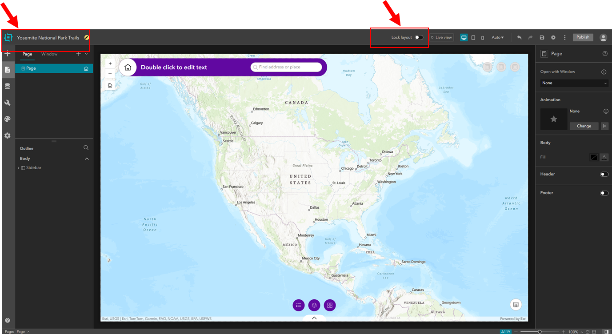

Since the layout is unlocked, all elements inside the app can be moved around, removed, or added. For example, you can click the search bar at the top of the page and select the trash icon to remove it.

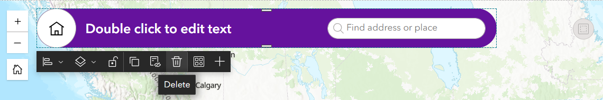

### 2) Adding Header

You can also toggle on the "Header" in the right toolbar to add a header to the top of the page. Headers are shared between pages, which means we need fewer configurations when we have multiple pages since we don't need to add/configure the header to each page separately.

Note: If you don't see the Header in the right sidebar, make sure that you have selected "**Page**" in the top-left sidebar, and **none** of the sections in the bottom-left sidebar (Outline) is selected. If any are selected, you can click on "**Page**" again to deselect them.

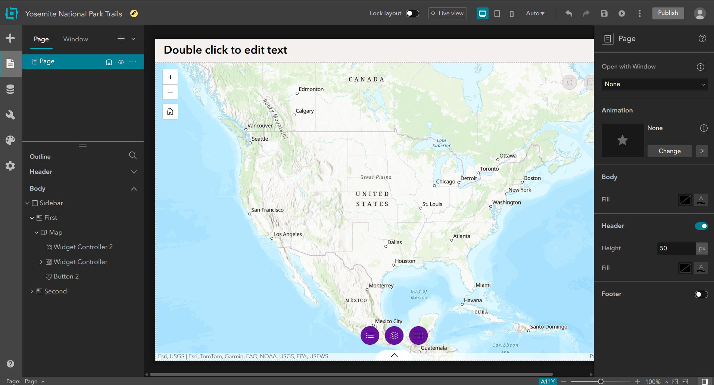

Once you have added the header, you can hover your cursor over the header on top of the canvas, and click on "Edit Header", and then double click to edit the header. First, click on the default text in the header and remove it. Then, we can use a header template by clicking on the icon for "Choosing a header template". **Make sure that the "Lock Layout" in top of the page is off, otherwise you won't be able to see the header templates.**

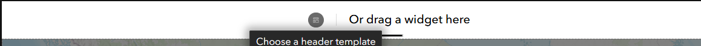

From the templates choose "Header 1".

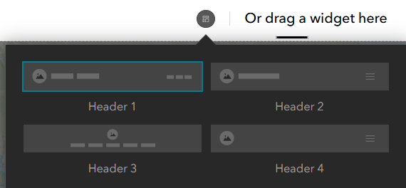

Now, you can add titles, subtitles, images, etc., in the header. You can also see that this template has a menu on the right side of the header (where it says "Page"), which is helpful for us because if we add pages, we can easily be able to switch between them.

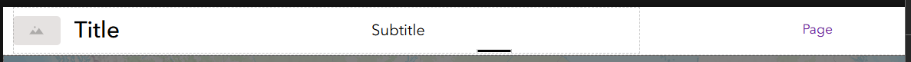

Add "Yosemite National Park" to the Title, and "Trails" to the Subtitle. Find an image of your choice and use it in the header by clicking on the image icon in the header and choose "Select an image" from the right sidebar and upload your image. You can change the size of each element, change their location, etc. in the header as well. Notice that for each element that you select from the header whether it's an image or a text, a new menu will appear in the right sidebar which allows you to make changes in the element.

Example header:\
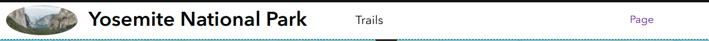

### 3) Adding Data

We have a map in the canvas, and in this step we want to add some data to it. From the menu on the left side of the page, we can navigate to the "Data" panel to add a variety of data types from different sources.

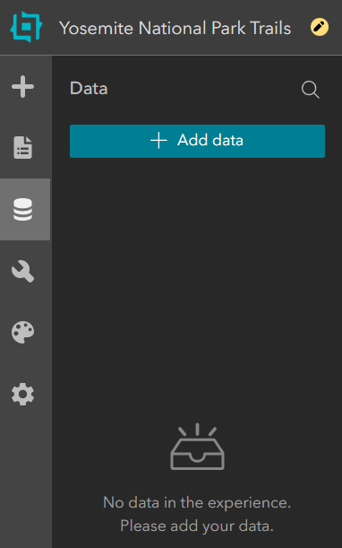 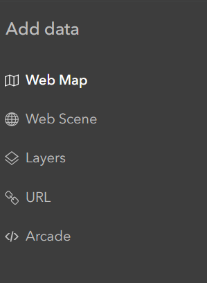

We want to add one map from the "Web Map" and one scene from the "Web Scene". In the **Web Map**, **select the ArcGIS Online tab**, and search for **Yosemite National Park Service Trails**, and select it. It should look like this:

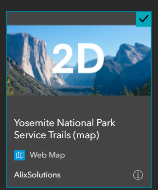

Then, navigate to the **Web Scene \> ArcGIS Online tab**, search for the same item, and select it as well. It should look like this:

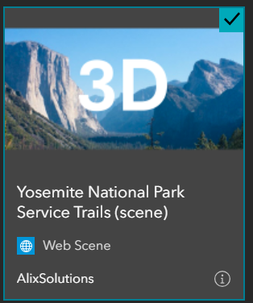

**Note: If you search the maps by their names, multiple maps appear in the list. Make sure to select the data that matches the exact name and image of the screenshots above.**

After selecting the maps, you'll see a small window in the bottom-right of the page that says "2 Selected", with a button next to it that says "Done". Click on "Done" to add the data to your app.

Now we have added the maps to the application, and we can add them to the map widget. To do that, select "Page" from the menu on the left side, and you'll see the panel on the right where you can configure your widgets. From the panel, click on "Content", then click on "Select Map".\
\
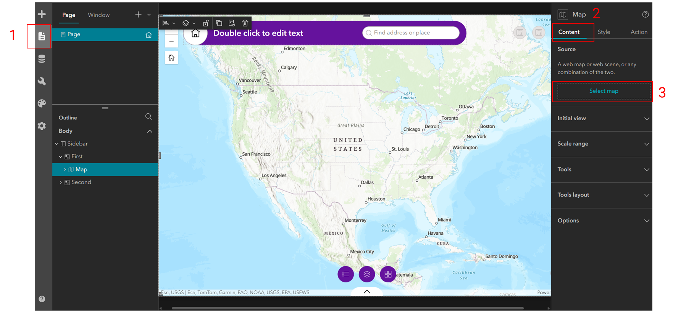\
\
Then, select both maps that we have added by clicking on them, and you'll see the web scene and the main active map. At any time during the development process, we can turn on the "Live View" in the top ribbon to test the app and switch between the maps by clicking on the map icon in the bottom left side of the map widget.

### 4) Adding Page

We can add some resources about Yosemite to the experience. Here, we want to add a story map for expedition in Yosemite from here:\
[https://storymaps.arcgis.com/stories/26c9b014718f46b6a2eb2dc1dc92acf3](https://storymaps.arcgis.com/stories/26c9b014718f46b6a2eb2dc1dc92acf3)

Also, we want to add the current condition information about the Yosemite from National Park Services (NPS) website in here:\
[https://www.nps.gov/yose/planyourvisit/conditions.htm](https://www.nps.gov/yose/planyourvisit/conditions.htm)

We want to add these information as pages in our app because we want everyone to get all the information they need about their trip by taking a quick look into our app.

From the left panel under "Page", click on the + icon and add a blank fullscreen page.

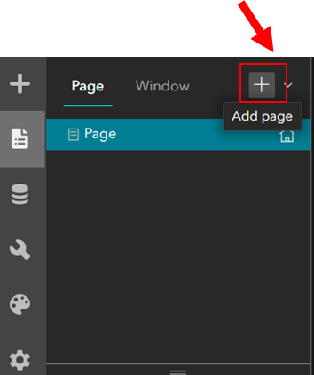

In the new page, enable the header from the right panel, and you'll see the number of pages appear in the header. You can add as many pages as you want. Change the name of the pages to "Trails" and "Resources" by clicking on the 3 dots next to their name, and you'll see that will automatically be reflected in the header.

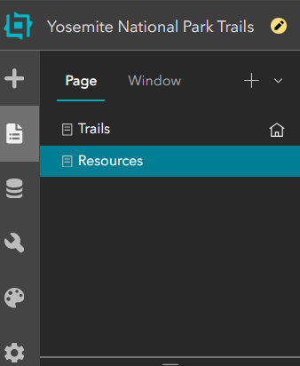

Then to add the storyline and current conditions web page, we click on "insert widget" in the left panel, and search for "Section", drag & drop it to the map.

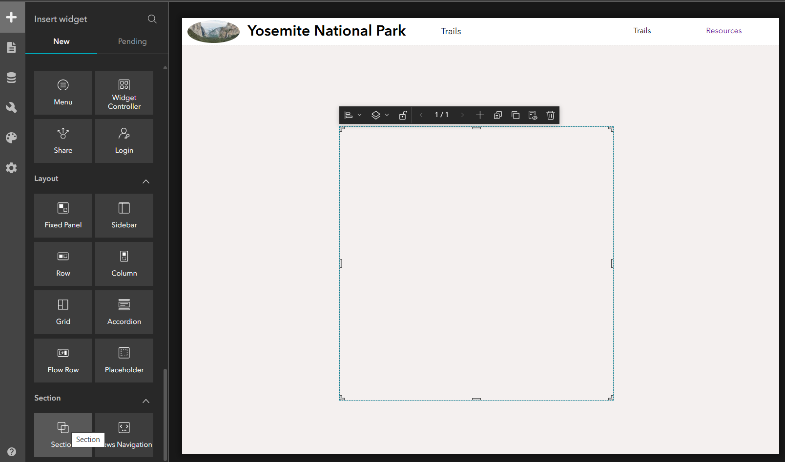

Then we click on the align option from the floating option bar in the top of the section on the map, and click on "Full Size" to make the section cover the full screen.

Now we want to embed external content, so we find "Embed" in the "Insert Widget" panel by searching it in its search bar, and drag and drop it in the canvas. Now, in the right panel, you'll see there is an option to add "URL", and you just copy and paste the URL for the story map here, and click enter to refresh the section.

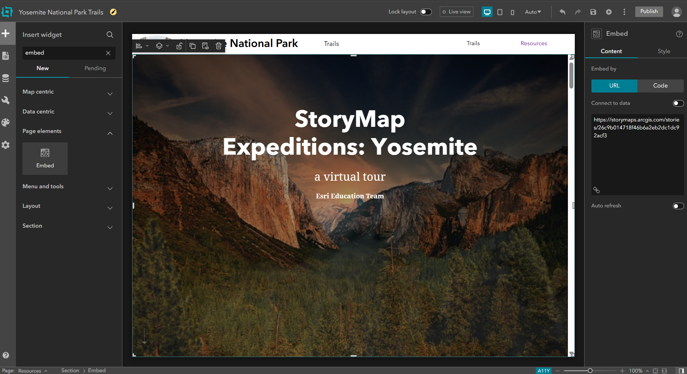

If we go back to the "Page" section from the left menu, we'll see the left Outline panel under "Body" \> "Section" contains one "View" which contains the "Embed".

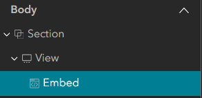

A section can have multiple views. We need another "View" to be able to add the NPS website, so we click on "View" from this panel, and on the right panel we'll see that we have an option to add a new view. We can also click on the 3 dots next to "View" in the right panel to create a duplicate view so we don't have to configure everything from scratch. After this, you'll see that the "View 2" will appear on the left Outline panel under Section. Now all we need to do is click on the "Embed 2" in this section and change the story map URL to NPS URL on the right panel.

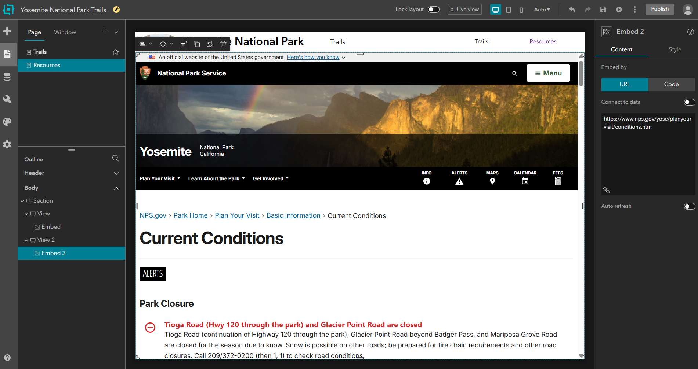

Once we're done, we can click on "Section" in the left Outline panel and then in the right panel, we can change the name of the first View to Expedition and change the View 2 to Information.

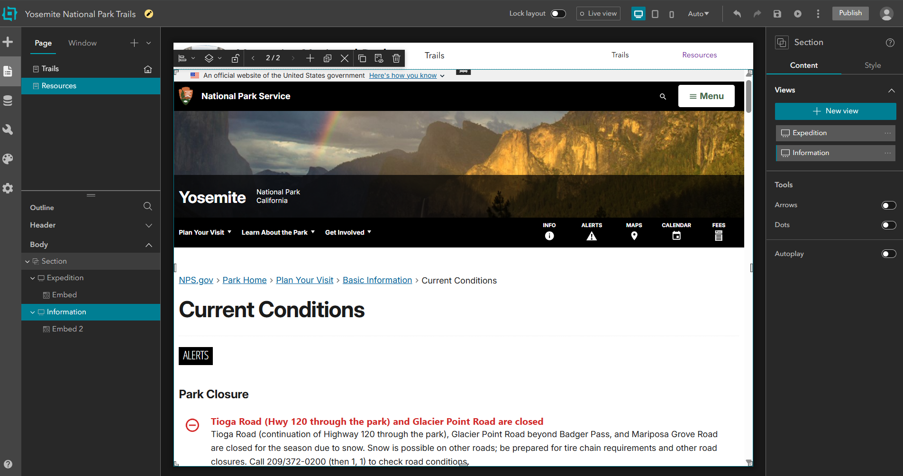

Now in order to navigate into the pages, we can hold the top part of the section (the one containing the embedded page) in the canvas and drag it lower to make some space between the header and the section in the canvas. Then, we can add "Views Navigation" from the Insert Widget to the empty space between the header and the embedded section. You also have an option to select the style of navigation bar.

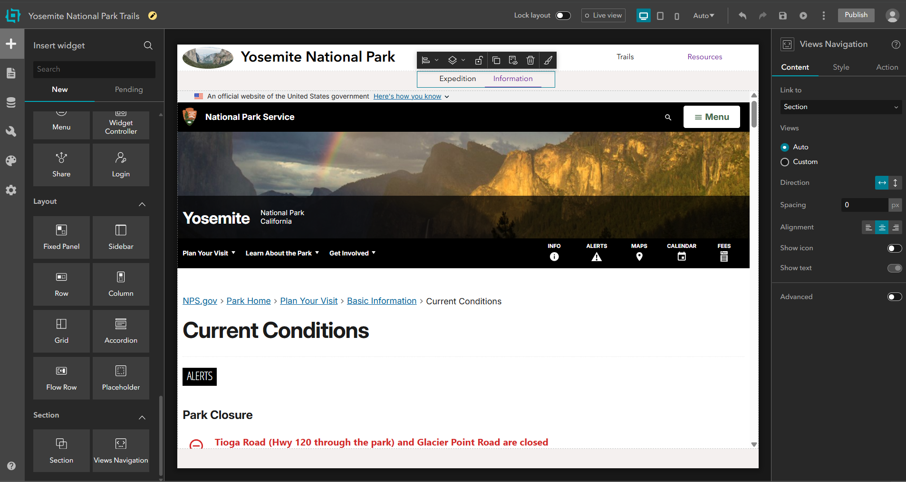

You can turn on Live View now to navigate through different pages seamlessly.

### 5) Connecting Widgets

Widgets can connect to other widgets and consume the data. For example if we click on the Trails page, and then click anywhere on the map in the canvas, we'll see "Map" appears in the left Outline bar. If we click on any section in the Map \> Widget Controller, for both Legend or Map Layers we can see both of them are connected to the "Map" widget as indicated in the right panel, and reflect the layers currently shown in the Map widget.

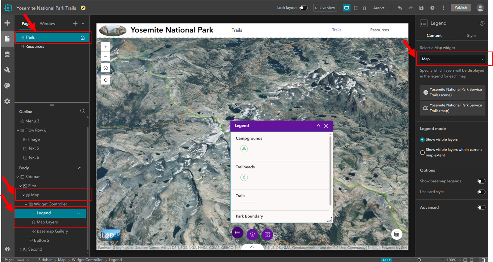

Let's add an elevation profile widget. Search for "Elevation Profile" in the Insert Widget, and drag and drop it on the bottom right side of the map. You can connect this widget to the map using the right panel.

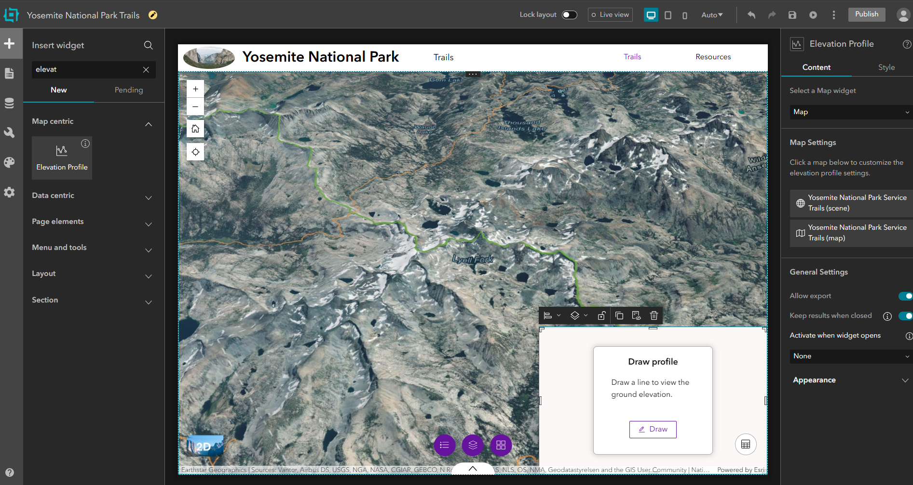

You can use this widget to get information about the layers in the map. So we can select "Yosemite National Park Service Trails (scene)" from the right panel, and toggle on the "Selectable Layers" option in the opened window. To test this, you can turn on the Live view and then click on "Select" or "Draw" in the elevation profile window, and select any trail to see its elevation profile.

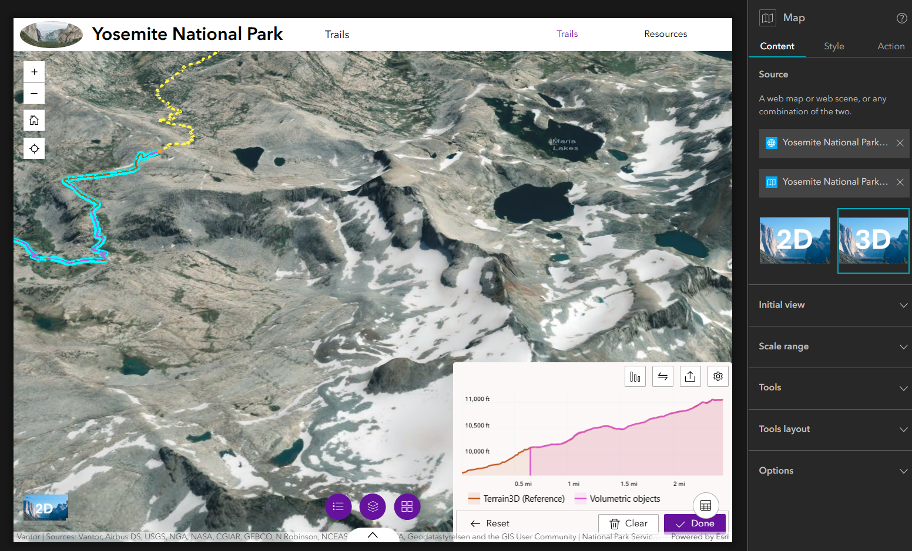

Widgets can also connect to layers. For example if we click on the widget controller on the bottom of the page, we can click on the + icon, and look for "Table" and add it to the widgets.

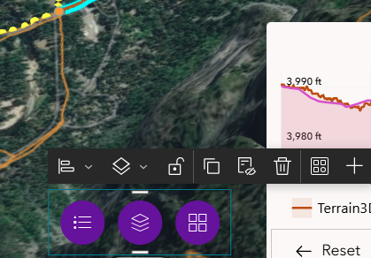

Then we can click on the table icon that has been added in the bottom of the page next to the other widgets, and select a layer (in our case "Map") from the right panel under "Content" to interact with the table. Then we can select the web scene, and toggle on the "customize layers", and only check the "Trails" from the "Layers" menu to only see the attribute information for the trails in the table.

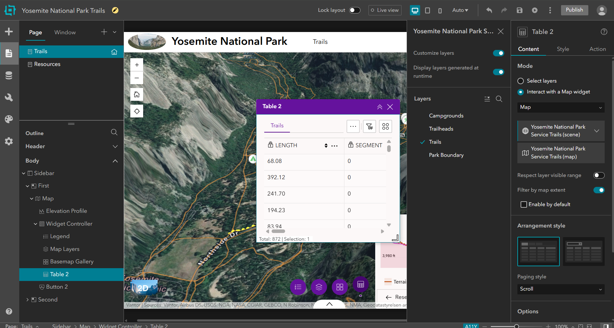

We can also change the theme of the widgets by clicking on the "Theme" specified with a palette in the left menu and selecting a theme from the list. You can pick a color based on the theme of your web app. For example here, I select "Meadow" because the theme is somehow relevant to the national park. You can also further customize the colors, fontsize, etc. by clicking on the "Customize" at the bottom of the theme list. Any changes you make here will be reflected on all pages.

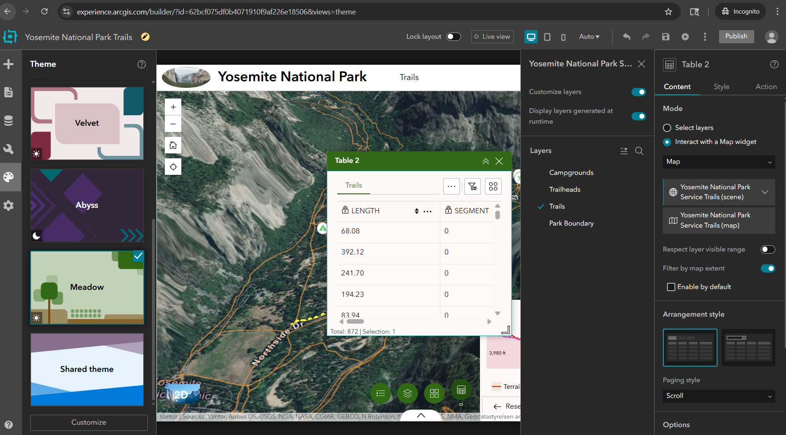

At any time that you are happy with the changes, you can save your project using the save button on top of the canvas, and preview the web app in a browser by clicking on the "preview" button on the right side of the save button.

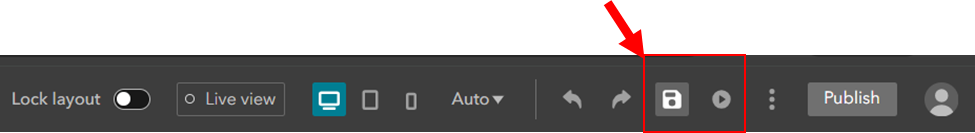

If you want to share this with someone, you can click on the "Publish" button next to the profile icon on top of the canvas, and then click on 3 dots next to the "Publish" button and copy published item link and share the link with others.

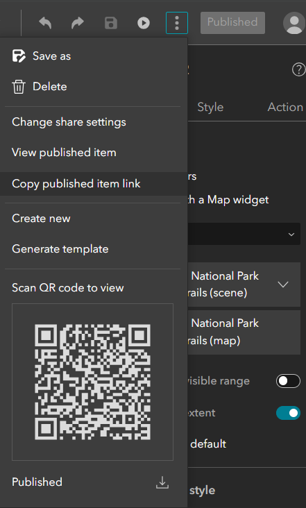

### 6) Adding Actions to the Widgets

You can define the interaction between widgets and their data using message actions. For example if you want to zoom in to the trail in the map if you click on the trail in the table, you can start by clicking on the table, and find the "Actions" tab in the right panel. Under message action, select "Add a Trigger", and then as the trigger you can select when the "Record selection changes" and click on it. Afterwards, as the target, you can select the map widget, and select "Zoom to" as the action.

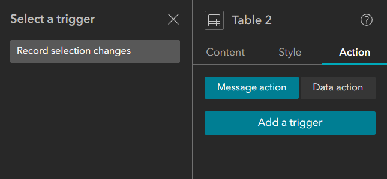

Now we also want the elevation of the trail to be shown in the elevation profile that we have added to the map. So still under the "Action" tab and "Message action" in the right panel, we click on "Add action", and this time we select "Elevation Profile" as the target, and select "View profile" as the action. Now in the Live View mode, you can test what you did by selecting a trail from the table.

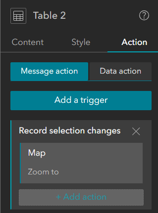

Now if you navigate to the "Data action" tab, you'll see that they're active by default, and you can turn them off if you want. These actions will allow users to process data in the app on demand. For example on the table, we can select the action button and for a selected segment we can zoom to it, show it on the map, load it in elevation profile and export it in the selected format. We can also do these for all the data in the table.

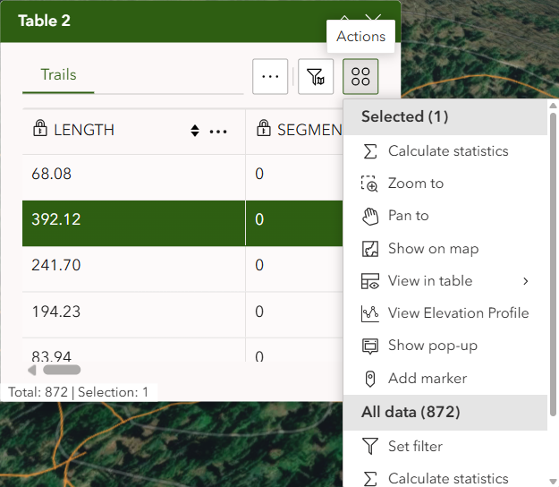

For example we can select "Calculate statistics", select a field for example "Miles" and see how many miles we have in this dataset.

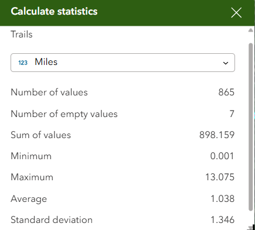

### 7) Dynamic Content & Data View

Some widgets do some analysis and they generate a result or output that we can use in other widgets. This allows us to customize the display of those values using other widgets. For example if we select a trail in the "Elevation Profile", this widget will generate some statistics on its own as well by clicking on the "Profile Statistics\" button and it generates an output as well.

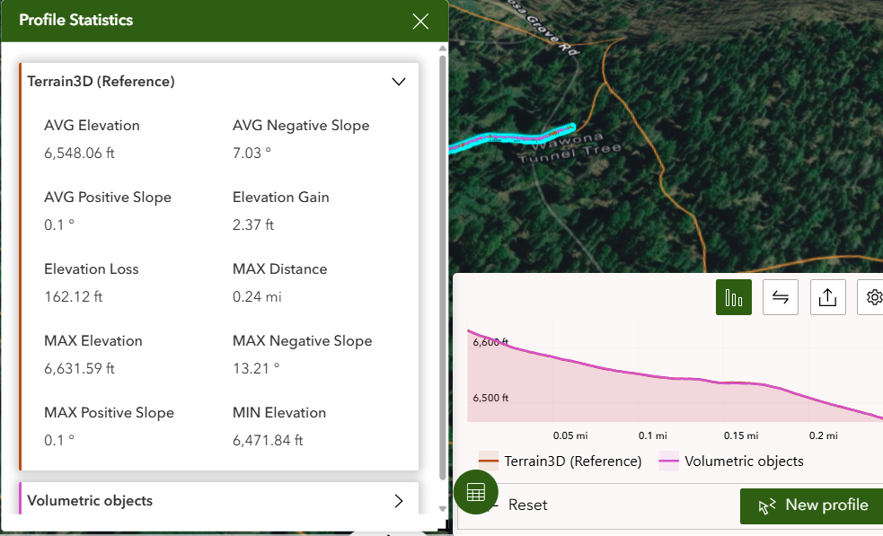

If we want to show this information dynamically in a different way, we can use a different widget. For example let's add a "Text" widget from the "Insert Widget" by searching for "Text", and drag and drop this widget on top of the elevation profile widget. We can type any text in the text widget, but we can also use values that come from the outside and show it inside the text box. To do this, we select the text from the map, and toggle on "Connect to data" from the right panel. Next, click on "Select Data", select the "Output" and then click on "Elevation Profile statistics" that is generated by the elevation profile.

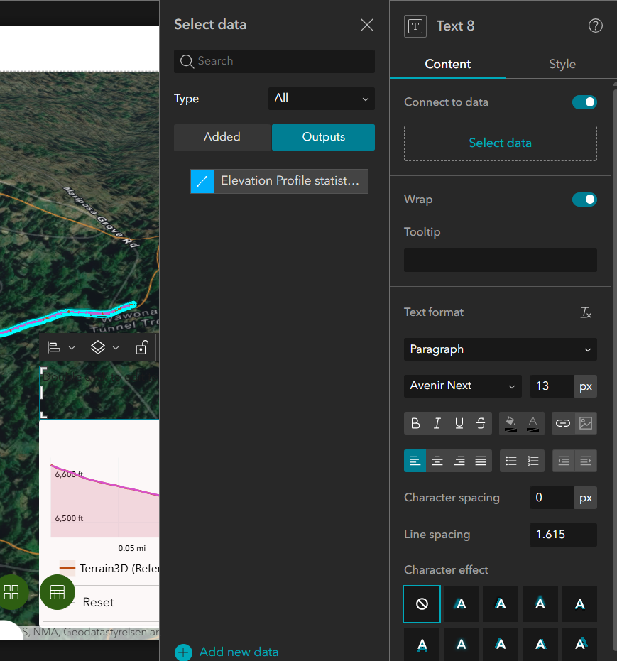

Next, we can just start typing in the text box, and add dynamic content when it's necessary. We can write a sentence about maximum distance and elevation gain by using MaxDistance and ElevationGain as our dynamic contents, and we should also change the Data selected features to Default. You can change the fontsize, fontcolor, etc. under the "Content" tab in the right panel, and you can also add background to the text using a background in the "Style" tab in the right panel. Now if you select different trails in the live view, you'll see that the elevation profile and hence the dynamic content in the text box changes based on the trail.

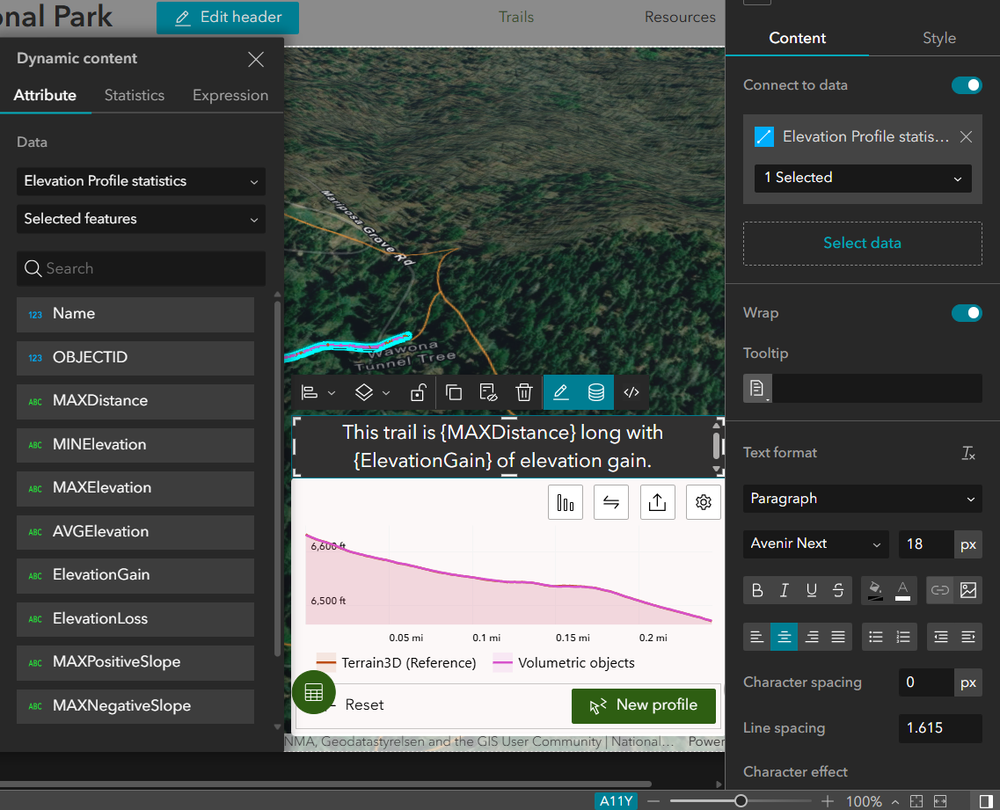

Let's connect the "Trails" as the subtitle in the header to the data as well. So we click on "Edit header" in the header, and select "Trails", and we connect it to "Trails" in the Web Scene.

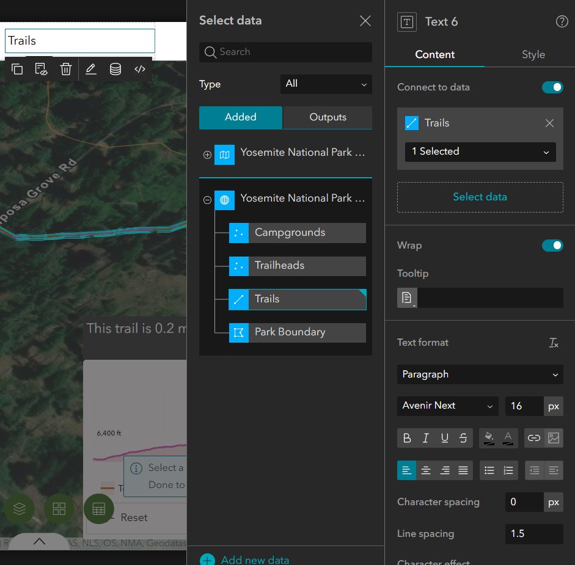

Now while you've selected the "Trails" in the header, select "Dynamic content" and this time select "Statistics" to calculate the total number of trails in this dataset. Therefore, select "Count" as the operator and unique "Trail Name" as the Field, then click Insert.

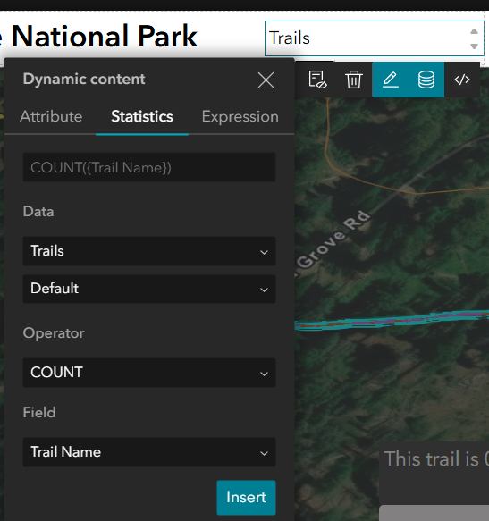

Now, select the trail subtitle in the header again, and on dynamic content, select "Expressions" so we can add the sum of miles of trails in this dataset. You can see there are 2 tabs for "Fields" and "Functions" which you can use to write an expression. You can use "Sum" from the Functions list, and "Miles" from the Fields list, and click on the gear in the bottom of the dynamic content pane to set the format of the number to have 0 decimal. Then you can click "Insert" to add it in the header.

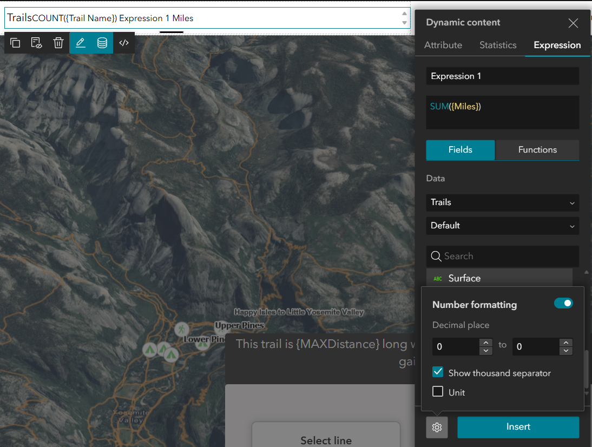

You can customize the view of a widget based on filtering or sorting of the data. We can create a custom view for our Trails in the header. For this purpose, we can navigate to "Data" in the left menu, select the web scene, click on the Trails feature layer, and click on "Create View".

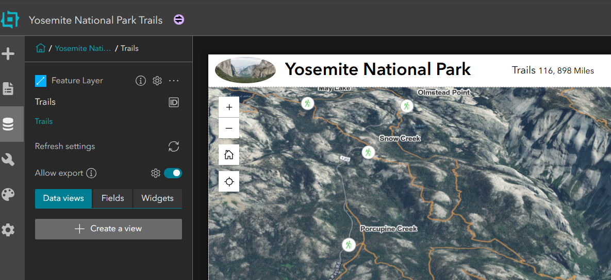

Now we want to create a view to only list the segments of trail that are part of the Half Dome expedition. So we type "Half Dome" as the name of the view, and then we click on "+ Add" to add a clause like below. You can see that 5 trails have been filtered. Then, click on "Apply Changes" in the bottom right of this window.\
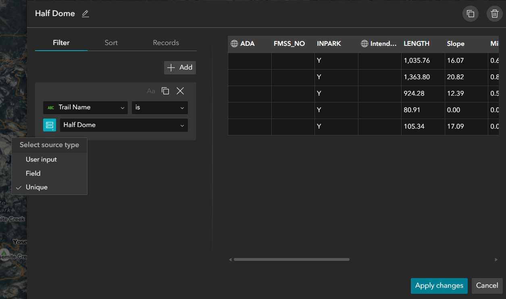

Now, in the main Canvas, click on table widget in the widget controller to change what data is being displayed in the table. For this purpose, after you click on the table icon on the Canvas, you'll see a panel is opened in the right side. Under Content tab in this panel, click on "Select layers", and then on "+ New sheet", then "Select Data", and then click on the small plus sign on the left side of the web scene and select "Trails".

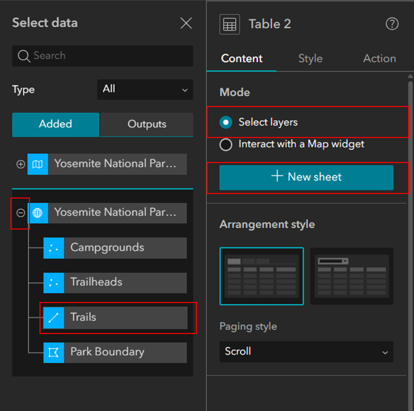

Once you do so, in the "Sheet Configuration" pane, click on the dropdown menu for "Trails" and select "Half Dome". You'll see the 5 filtered trails in Half Dome are listed in this table.

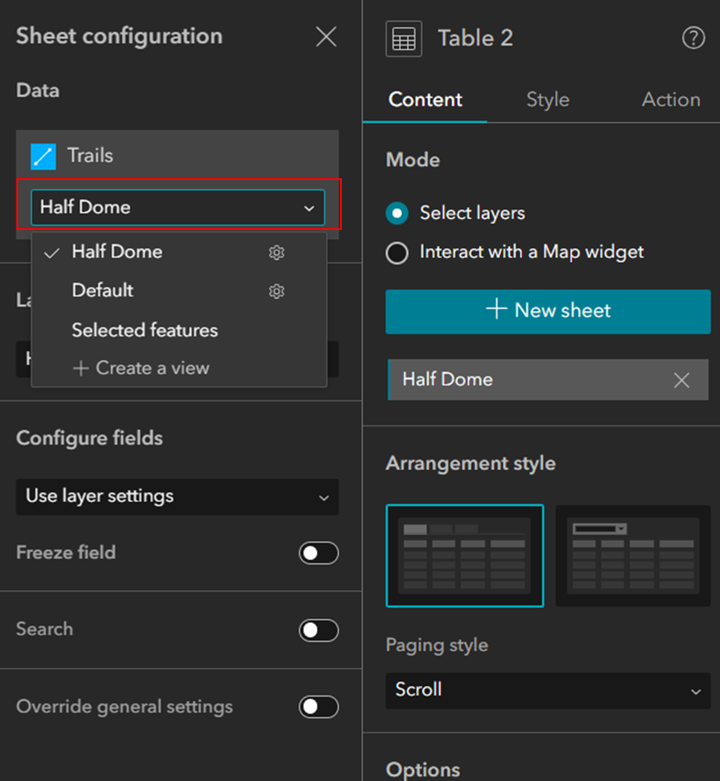

If you want, you can add more tabs to this table to show different expeditions.

Now we'd like to display information about trails as we select them in the table or on the map. To do this, we can use the feature info widget which allows us to display the pop-up for features. So in the left panel under "Insert widget", we look for "Feature info" widget, and drag and drop it on the top of the elevation profile. Next, on the right panel under Content click on "Select Data" \> "Add Data" \> "Select data" \> dropdown menu on web scene \> "Trails" from the dropdown menu options.

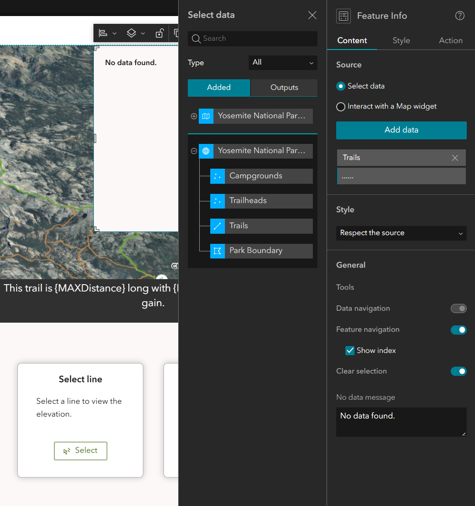

After the "Trails" has been selected, change the selection from "Default" to "Selected features".

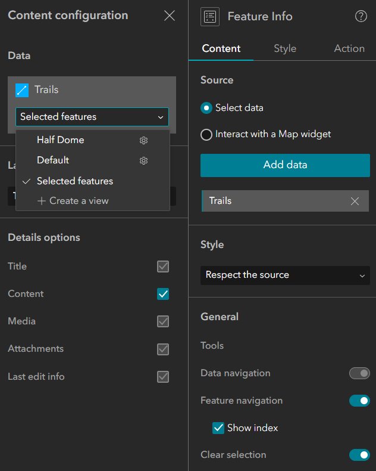

Once you're done, you can go back to "Live view" and select a trail from the map, and you'll see the pop-up that we just added shows the miles for this layer.

**8) Adding chart:\
\**
From the "insert widget" panel, look for "Chart" and drag and drop it in the page. In the right panel, click on "Select data", and then expand the web map and select Trails.

Then, click on "select chart" in the right panel, and select "column chart". In the chart configuration in the right panel keep everything as they are but only make the below changes:\
- Under "**Data**" dropdown menu, set the "Category field" to "Intended Use".

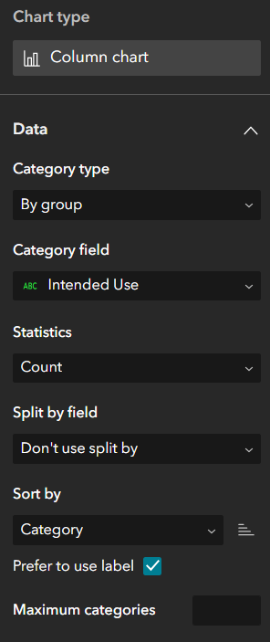

\- Under "**Axes**" dropdown menu, select the X axis, and set the X axis title to "Intended Use". Also, increase the character limit from 11 to 30 so the labels for each bar in the x axis are not cut off.\
Set the Y axis title to "Number of Trails".

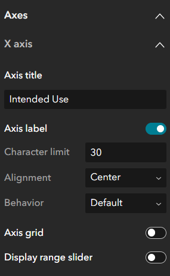 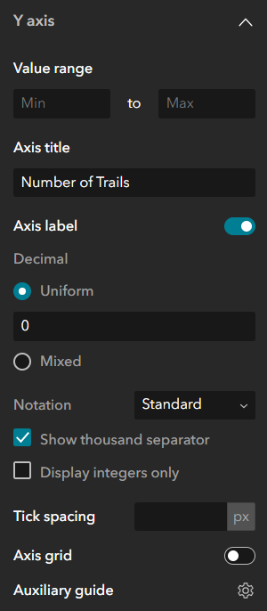

Under General dropdown menu, set the chart title to "Trail Distribution by Intended Use" and description to "Number of trails grouped by their designated intended use in Yosemite National Park".

Now if you take a look at the chart, you'll see that we have a bar for "Null", which is not useful for users, and we should filter them out. So from the Data in the right panel, we click on "Create a view".\
\
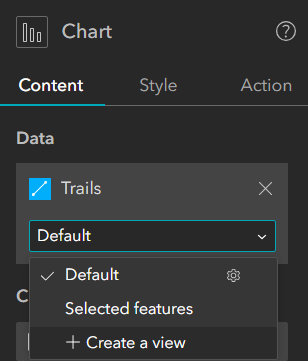

Then, we have to create a filter to filter out all the fields that their "Intended Use" "is not blank" by adding a clause as below:\
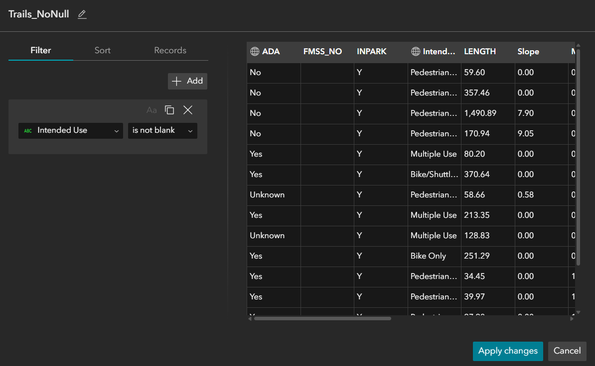\
Once you did so, click on "Apply Changes", and select the "Trails_NoNull" from the Trails options:

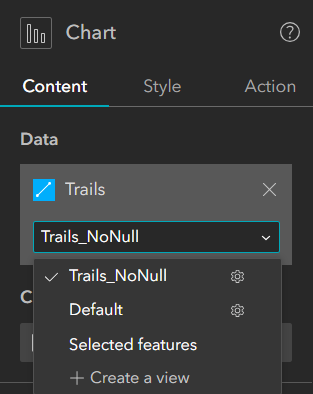

If you do so, you'll see that Null still appears in the chart and the reason is that we just filtered the blank fields, but some fields are not blank and they have a text value of "Null" written in them.\
So you need to click on the gear next to the Trails_NoNull to adjust the filter again.

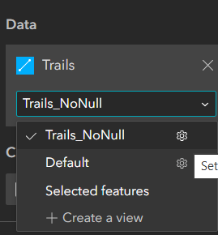

Under the Filter tab, we need to add a second clause, select "intended use" as the field, select "does not start with" as the condition, and type "Null". Once you did so, click on Apply changes.

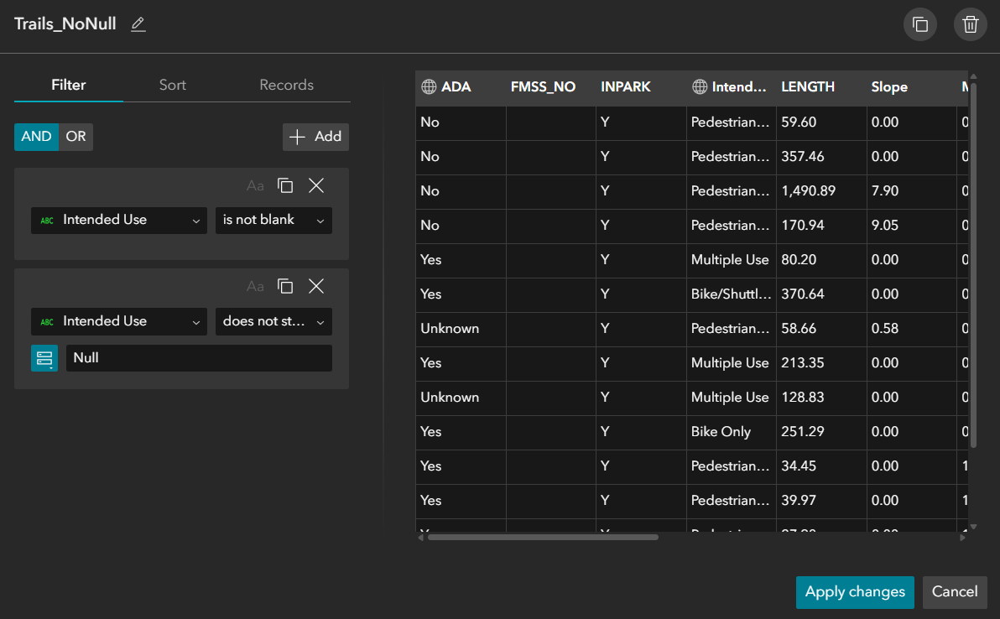

Now we can make the chart connected to the map so based on the extent of the map (when the user zooms in or zooms out) the bar chart gets updated. In Experience Builder, zooming or panning the map only changes what you see visually, and it does not automatically change the data that other widgets (like charts) are using. A chart reads from a dataset, not from what is currently visible on the screen. That is why we need to create a map-extent data view, so the chart changes based on the map extent. A data view is a filtered version of a layer that can respond to the current map extent. When the user zooms or pans, the data view updates to include only the features inside the visible area, and the chart (because it is connected to that data view) updates automatically.\
\
To do so, click anywhere on the map in the canvas, then in the right panel, click on Add a trigger, select "Extent changes" as trigger, select data as target and select Filter data records as action. Then on the extended panel in the right, click on "Select data", and expand the web map and click on Trails. Once you did so, on the right panel under the "Message action" click on "Data" in the "Extent changes", and change the Trails option from 1 selected to Trails_NoNull.

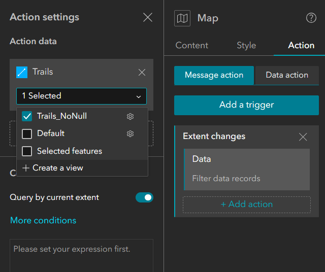

Now if you zoom in and zoom out in the map in the Live View, you\'ll see that the bar charts get updated.\
\
In order to organize the widgets on the map, from the "insert widget", search for "column" and drag and drop it in the map, and add the elevation profile, bar chart and dynamic text box inside it.

### 9) Mobile Optimization

In ArcGIS Experience Builder, header layouts can be modified to fit the screen size to optimize the user experience when viewing on different devices. For example, phones have small screens, tablets have medium screens, and laptops have large screens. Certain full-screen app templates use a header created with a Fixed Panel widget instead of the header setting from the Page. This is when we need to manually modify the header size. To do that, you can click on the screen size button to edit the page.

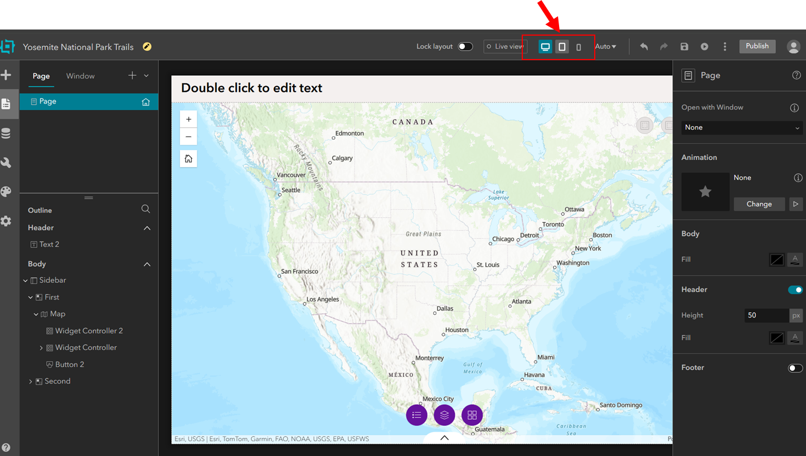

If you want to modify the page for small-screen devices, select Small from the top bar. Then, on the canvas next to the header, you will see "**Auto**" and "**Custom**" options.

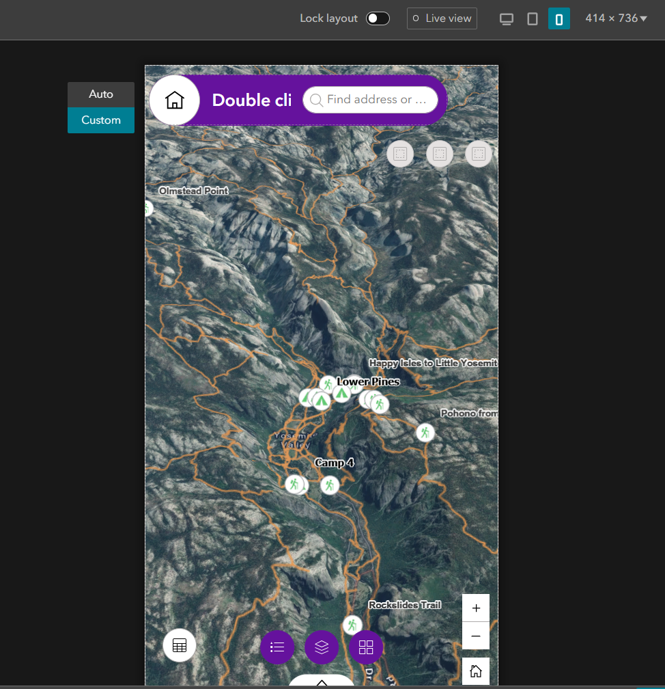

**Auto** means the mobile layout is automatically generated from your desktop layout. Experience Builder rearranges and stacks widgets for small screens. You don't manually redesign it. It tries to make everything responsive.

**Custom** means you manually design the mobile layout. You can move widgets, resize them, hide some widgets, change alignment, and reorganize into columns or sections. So when you click Custom in the mobile view, you are creating a separate mobile layout that is independent from desktop.

Now let's make some changes in the **mobile** view. On the top of the page, if you select the mobile (smallest size screen) you'll see that the layout is a bit different from the bigger screen sizes, and some widgets are missing in this view such as the title in the header, the elevation profile, etc.

For the missing widgets, you can find them under "Insert widget" and in the "Pending" tab. So you can add them and change them according to the mobile view.

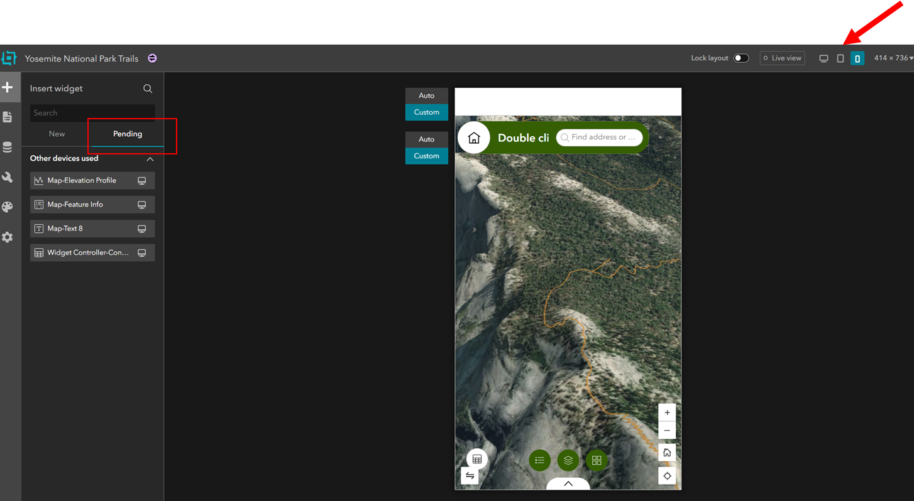

On the left side of the canvas, we see the layout options which are "Auto" and "Custom". If we set the option to "Custom", it means that whatever change we make in the mobile view won't appear in other views. Now if we drag the "Map Elevation Profile" from the pending widgets to the screen, we see that it covers most of the screen. To fix this issue, we can drag the elevation profile window on the canvas and place it in the controller widgets on the bottom of the canvas.

  ------------------------------------------------------------------------------------------------------------------------------------------------------------------------------------------------------------------------------------------------------------------------------------------------------------------------------------------------------------
  Before adding elevation profile                                                                                                                                                           After adding elevation profile
  ----------------------------------------------------------------------------------------------------------------------------------------------------------------------------------------- ------------------------------------------------------------------------------------------------------------------------------------------------------------------
  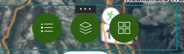   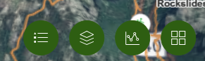

  ------------------------------------------------------------------------------------------------------------------------------------------------------------------------------------------------------------------------------------------------------------------------------------------------------------------------------------------------------------

If you go back to the large screen view, you'll see the changes have not been applied here.

**If we make any changes to the content of a widget, this will be reflected on both views.** For example in the mobile screen if we hover over the title and click on "Edit Header", we can add the text (in this case Text 5) from the pending widgets to the header, you'll see "Yosemite National Park" will appear in the header, and is occupying a large portion of the header.

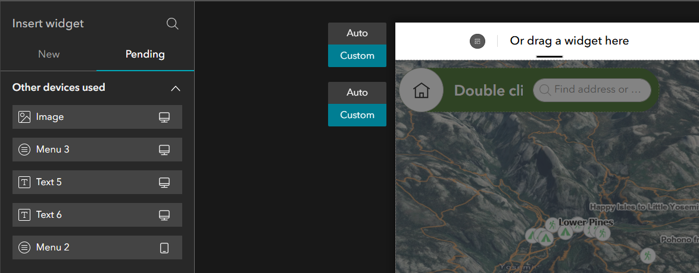

Now if you change the header content from "Yosemite National Park" to "Yosemite" and go back to the large screen view, you'll see this change in the large screen view as well, which is not what we want. So what we can do, is while selecting the "Yosemite National Park" in the mobile view, we click on "Duplicate" on the small menu that appears for this text.

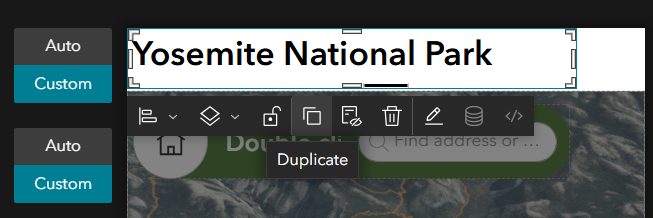

Then, we select the original text to move it to pending widgets by selecting "Page" from the main menu on the left side, and select your header text name in the Outline (in this case Text 5) and right click on it and select "Move to pending list".

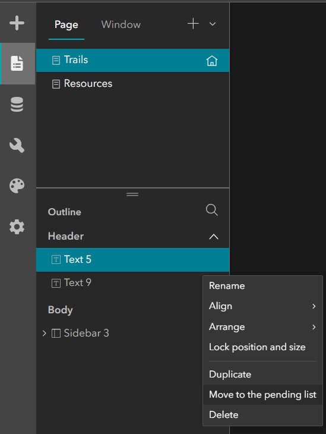

Then, you can make changes to the duplicate text instead, and change it from "Yosemite National Park" to "Yosemite" and change its placement to center. You can also add the "Image" from the pending widgets list to the header. You can also add the menu (in this case Menu 3) from the pending widgets to the header so we can also have access to other pages.

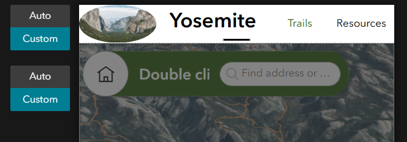

### 10) Publishing Apps

Once you're done with the app configuration, you can save and publish the app.
